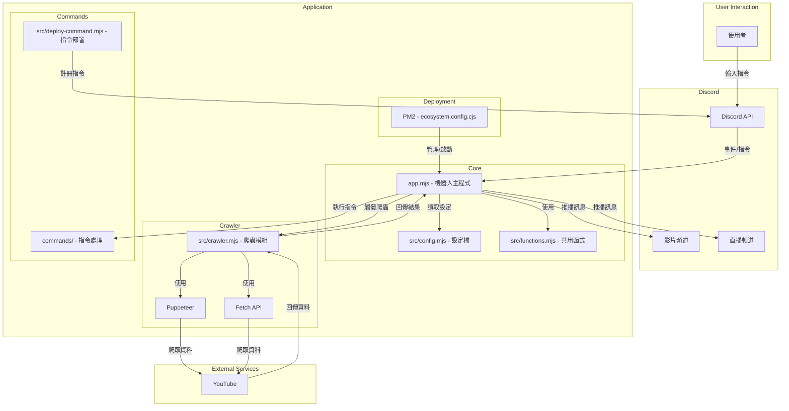
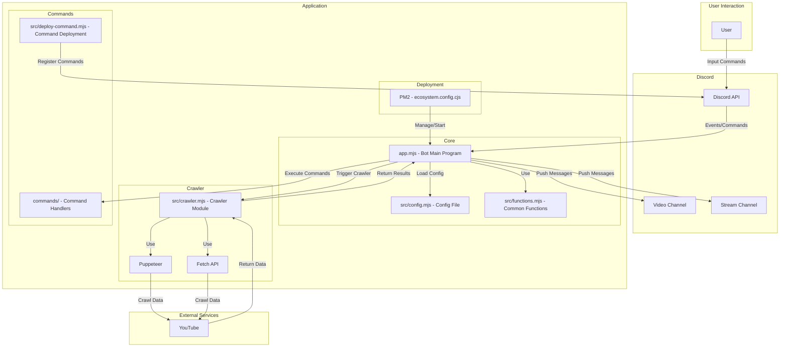

# YouTube 影片、直播爬蟲 Discord 機器人推播系統 (自動/手動)

## 安裝說明

1. 安裝相依套件
```bash
npm i
```

2. 建立 .env 檔案
請參考 .env.example 檔案，設定以下環境變數：

```
TOKEN=            # Discord 機器人 Token
CLIENT_ID=        # Discord 應用程式 ID
GUILD_ID=         # Discord 伺服器 ID
VIDEO_CHANNEL_ID= # 影片通知頻道 ID
STREAM_CHANNEL_ID= # 直播通知頻道 ID
CRAWLER_TYPE=fetch # 爬蟲類型 (fetch 或 puppeteer)
```

3. 啟動應用程式

開發模式：
```bash
npm run dev
```

生產模式：
```bash
npm start
```

## 專案說明

本專案是一個 Discord 機器人，用於自動爬取 YouTube 頻道的最新影片和直播，並將其推送到指定的 Discord 頻道。機器人會在每小時整點和半點自動檢查已設定的 YouTube 頻道，抓取當天的新影片，並發送到指定的 Discord 頻道（已發送過的影片不會重複發送）。

## Discord 頻道指令

### 影片指令
- `!vd ls`: 獲取頻道列表
- `!vd add @[頻道名稱]`: 添加頻道到列表
- `!vd del @[頻道名稱]`: 從列表中刪除頻道
- `!clr`: 爬取並保存影片
- `!vd`: 獲取影片

### 直播指令
- `!st ls`: 獲取頻道列表
- `!st add @[頻道名稱]`: 添加頻道到列表
- `!st del @[頻道名稱]`: 從列表中刪除頻道
- `!clr`: 爬取並保存直播
- `!st`: 獲取直播

## 部署說明

本專案使用 PM2 進行部署和管理。以下是相關指令：

```bash
# 啟動應用程式
npm start

# 查看應用程式狀態
pm2 status

# 查看應用程式日誌
pm2 logs yt_dc_bot

# 重啟應用程式
pm2 restart yt_dc_bot

# 停止應用程式
pm2 stop yt_dc_bot
```

## 技術棧

- Node.js
- Discord.js
- PM2
- YouTube API
- Puppeteer/Fetch API

---

## 系統架構


---

# YT Video, Stream Crawler, Discord Robot Push Broadcast (Auto/Manual)

## Installation Guide

1. Install node_modules
```bash
npm i
```

2. Create .env file
Please refer to .env.example file and set the following environment variables:

```
TOKEN=            # Discord bot token
CLIENT_ID=        # Discord application ID
GUILD_ID=         # Discord server ID
VIDEO_CHANNEL_ID= # Video notification channel ID
STREAM_CHANNEL_ID= # Stream notification channel ID
CRAWLER_TYPE=fetch # Crawler type (fetch or puppeteer)
```

3. Run the application

Development mode:
```bash
npm run dev
```

Production mode:
```bash
npm start
```

## Description

This project is a Discord bot that automatically crawls the latest videos and streams from YouTube channels and pushes them to designated Discord channels. The bot automatically checks the configured YouTube channels at the top and half of each hour, grabs new videos from the current day, and sends them to the specified Discord channel (videos that have been sent will not be sent again).

## Discord Channel Commands

### Video commands
- `!vd ls`: Get channel list
- `!vd add @[channel name]`: Add channel to list
- `!vd del @[channel name]`: Delete channel from list
- `!clr`: Crawl and save videos
- `!vd`: Get videos

### Stream commands
- `!st ls`: Get channel list
- `!st add @[channel name]`: Add channel to list
- `!st del @[channel name]`: Delete channel from list
- `!clr`: Crawl and save streams
- `!st`: Get streams

## Deployment

This project uses PM2 for deployment and management. Here are the relevant commands:

```bash
# Start the application
npm start

# Check application status
pm2 status

# View application logs
pm2 logs yt_dc_bot

# Restart the application
pm2 restart yt_dc_bot

# Stop the application
pm2 stop yt_dc_bot
```

## Tech Stack

- Node.js
- Discord.js
- PM2
- YouTube API
- Puppeteer/Fetch API

---

## System Architecture
