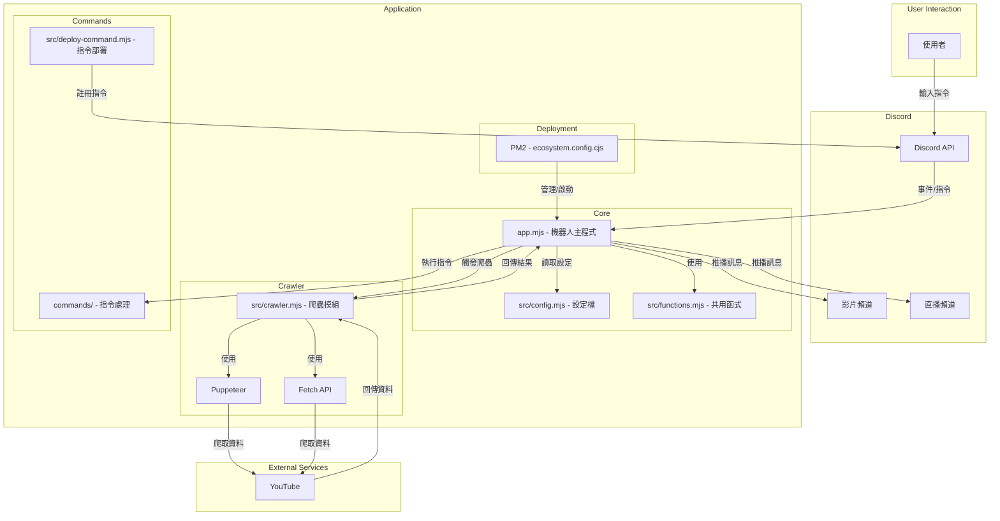
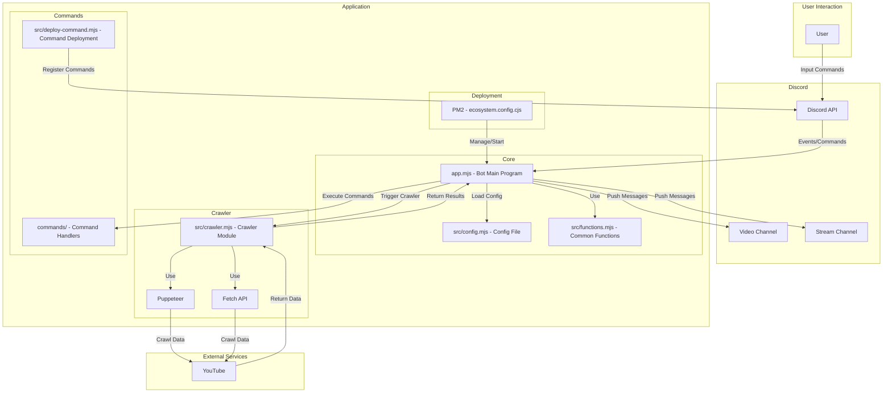

# YouTube 影片、直播爬蟲 Discord 機器人推播系統 (自動/手動)

一個功能完整的 Discord 機器人，能夠自動爬取 YouTube 頻道的最新影片和直播，並提供音樂播放功能。

## ✨ 主要功能

### 🎯 核心功能
- **自動爬蟲**：每30分鐘自動檢查已設定的 YouTube 頻道
- **智能推播**：自動發送當天的新影片到指定 Discord 頻道
- **防重複機制**：已發送過的影片不會重複發送
- **音樂播放**：支援 YouTube 音樂播放、暫停、循環等功能
- **頻道管理**：靈活的頻道新增、刪除和列表管理

### 🔧 技術特色
- **模組化架構**：代碼拆分為多個專責模組，易於維護
- **完整日誌系統**：結構化日誌記錄，支援檔案輪轉
- **健康監控**：系統狀態監控和性能指標收集
- **優雅關閉**：信號處理和資源清理機制
- **輸入驗證**：全面的安全性檢查和輸入驗證
- **錯誤恢復**：強化的錯誤處理和自動重試機制

## 🚀 快速開始

### 1. 環境需求
- Node.js 18.0 或更高版本
- npm 或 yarn 套件管理器
- Discord 應用程式和機器人 Token
- yt-dlp（用於音樂播放功能）

### 2. 安裝步驟

```bash
# 複製專案
git clone https://github.com/RayLiu1999/yt_discord_bot.git
cd yt_discord_bot

# 安裝相依套件
npm install

# 複製並設定環境變數
cp .env.example .env
# 編輯 .env 文件，填入必要的配置資訊
```

### 3. 環境變數配置

請參考 `.env.example` 文件，設定以下必要環境變數：

```env
# Discord Bot 基本配置
TOKEN=your_discord_bot_token
CLIENT_ID=your_discord_client_id
GUILD_ID=your_discord_server_id
VIDEO_CHANNEL_ID=your_video_channel_id
STREAM_CHANNEL_ID=your_stream_channel_id

# 其他配置項目請參考 .env.example
```

### 4. 啟動應用程式

```bash
# 開發模式
npm run dev

# 生產模式
npm start
```

## 📖 指令說明

### 🎬 影片相關指令
- `!vd` - 獲取最新影片列表
- `!vd ls` - 顯示已追蹤的影片頻道列表
- `!vd add @[頻道名稱]` - 新增頻道到追蹤列表
- `!vd del @[頻道名稱]` - 從追蹤列表中移除頻道

### 📺 直播相關指令
- `!st` - 獲取最新直播列表
- `!st ls` - 顯示已追蹤的直播頻道列表
- `!st add @[頻道名稱]` - 新增頻道到追蹤列表
- `!st del @[頻道名稱]` - 從追蹤列表中移除頻道

### 🎵 音樂播放指令
- `!join` - 機器人加入語音頻道
- `!play [YouTube URL]` - 播放 YouTube 音樂
- `!pause` - 暫停音樂
- `!resume` - 繼續播放
- `!stop` - 停止播放
- `!restart` - 重新播放當前曲目
- `!loop` - 切換循環播放模式
- `!leave` - 離開語音頻道

### ⚙️ 系統指令
- `!clr` - 手動觸發爬蟲

## 🏗️ 專案架構

```
yt_discord_bot/
├── src/                      # 源代碼目錄
│   ├── commandHandler.mjs    # 指令處理器
│   ├── musicManager.mjs      # 音樂播放管理器
│   ├── schedulerManager.mjs  # 定時器管理器
│   ├── crawler.mjs           # 爬蟲模組
│   ├── functions.mjs         # 通用函數庫
│   ├── logger.mjs            # 日誌系統
│   ├── constants.mjs         # 常數定義
│   ├── validators.mjs        # 輸入驗證
│   ├── configManager.mjs     # 配置管理
│   ├── healthMonitor.mjs     # 健康監控
│   ├── config.mjs            # 基本配置
│   └── path.mjs              # 路徑定義
├── commands/                 # Slash 指令目錄
├── logs/                     # 日誌檔案（自動生成）
├── app.mjs                   # 主應用程式入口
├── package.json              # 套件配置
├── ecosystem.config.cjs      # PM2 配置
└── .env.example              # 環境變數範例
```

## 🔧 部署說明

### 使用 PM2 部署

```bash
# 安裝 PM2
npm install -g pm2

# 啟動應用程式
npm start

# 查看狀態
pm2 status

# 查看日誌
pm2 logs yt_dc_bot

# 重啟應用程式
pm2 restart yt_dc_bot

# 停止應用程式
pm2 stop yt_dc_bot
```

### Docker 部署（待實作）

```bash
# 建構 Docker 映像
docker build -t yt-discord-bot .

# 運行容器
docker run -d --name yt-bot --env-file .env yt-discord-bot
```

## 📊 監控和日誌

### 日誌系統
- 自動日誌輪轉（當檔案超過 10MB 時）
- 多級別日誌記錄（ERROR, WARN, INFO, DEBUG）
- 結構化日誌格式，便於分析

### 健康監控
- 系統資源使用監控
- 記憶體洩漏檢測
- 錯誤率統計
- 爬蟲執行狀態監控

## 🛠️ 開發指南

### 代碼結構
- **模組化設計**：每個功能模組職責單一，易於測試和維護
- **錯誤處理**：統一的錯誤處理機制和日誌記錄
- **配置管理**：集中式配置管理，支援環境變數覆蓋
- **安全性**：輸入驗證和安全性檢查

### 新增功能
1. 在對應的管理器類別中新增方法
2. 更新 `commandHandler.mjs` 中的指令處理邏輯
3. 添加必要的輸入驗證和錯誤處理
4. 更新文檔和測試

## 🔒 安全性考量

- **輸入驗證**：所有用戶輸入都經過嚴格驗證
- **錯誤處理**：避免敏感資訊洩露
- **依賴更新**：定期更新套件以修復安全漏洞
- **權限控制**：適當的 Discord 權限設定

## 🐛 故障排除

### 常見問題

1. **機器人無法啟動**
   - 檢查 `.env` 文件中的 TOKEN 是否正確
   - 確認所有必要的環境變數都已設定

2. **爬蟲無法運作**
   - 檢查網路連線
   - 確認 YouTube 頻道 ID 格式正確
   - 查看日誌檔案獲取詳細錯誤資訊

3. **音樂播放失敗**
   - 確認已安裝 yt-dlp
   - 檢查 YouTube URL 是否有效
   - 確認機器人有語音頻道權限

### 日誌分析
- 檢查 `logs/error.log` 獲取錯誤詳情
- 使用 `logs/app.log` 查看一般操作記錄
- 啟用 DEBUG 模式獲取更詳細的日誌

## 🤝 貢獻指南

歡迎貢獻！請遵循以下步驟：

1. Fork 專案
2. 建立功能分支 (`git checkout -b feature/AmazingFeature`)
3. 提交更改 (`git commit -m 'Add some AmazingFeature'`)
4. 推送到分支 (`git push origin feature/AmazingFeature`)
5. 開啟 Pull Request

## 📄 授權條款

本專案採用 ISC 授權條款。詳情請參考 LICENSE 文件。

## 🚧 未來計劃

- [ ] Docker 容器化支援
- [ ] Web 管理界面
- [ ] 資料庫整合
- [ ] 多伺服器支援
- [ ] 更多音樂平台支援
- [ ] 單元測試覆蓋
- [ ] 效能優化

## 📞 支援

如有問題或建議，請：
- 開啟 GitHub Issue
- 聯繫維護者

---

## 技術棧

- **Node.js** - 執行環境
- **Discord.js** - Discord API 套件
- **PM2** - 程序管理器
- **yt-dlp** - YouTube 下載工具
- **Cheerio** - HTML 解析
- **Node-fetch** - HTTP 客戶端

---

## 系統架構


---

# YT Video, Stream Crawler, Discord Robot Push Broadcast (Auto/Manual)

## Installation Guide

1. Install node_modules
```bash
npm i
```

2. Create .env file
Please refer to .env.example file and set the following environment variables:

```
TOKEN=            # Discord bot token
CLIENT_ID=        # Discord application ID
GUILD_ID=         # Discord server ID
VIDEO_CHANNEL_ID= # Video notification channel ID
STREAM_CHANNEL_ID= # Stream notification channel ID
CRAWLER_TYPE=fetch # Crawler type (fetch or puppeteer)
```

3. Run the application

Development mode:
```bash
npm run dev
```

Production mode:
```bash
npm start
```

## Description

This project is a Discord bot that automatically crawls the latest videos and streams from YouTube channels and pushes them to designated Discord channels. The bot automatically checks the configured YouTube channels at the top and half of each hour, grabs new videos from the current day, and sends them to the specified Discord channel (videos that have been sent will not be sent again).

## Discord Channel Commands

### Video commands
- `!vd ls`: Get channel list
- `!vd add @[channel name]`: Add channel to list
- `!vd del @[channel name]`: Delete channel from list
- `!clr`: Crawl and save videos
- `!vd`: Get videos

### Stream commands
- `!st ls`: Get channel list
- `!st add @[channel name]`: Add channel to list
- `!st del @[channel name]`: Delete channel from list
- `!clr`: Crawl and save streams
- `!st`: Get streams

## Deployment

This project uses PM2 for deployment and management. Here are the relevant commands:

```bash
# Start the application
npm start

# Check application status
pm2 status

# View application logs
pm2 logs yt_dc_bot

# Restart the application
pm2 restart yt_dc_bot

# Stop the application
pm2 stop yt_dc_bot
```

## Tech Stack

- Node.js
- Discord.js
- PM2
- YouTube API
- Puppeteer/Fetch API

---

## System Architecture
