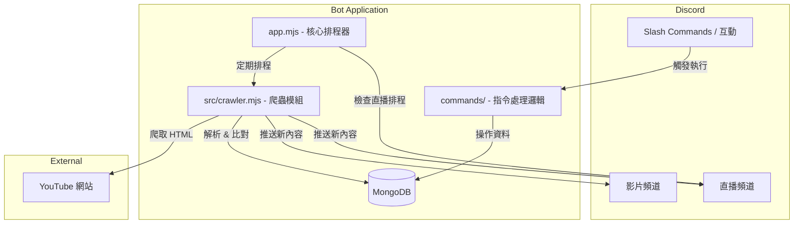
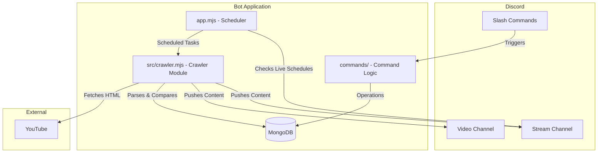

# YouTube 影片、直播爬蟲 Discord 機器人推播系統 | YouTube Crawler Discord Bot

[English](#english-version) | [中文版](#中文版)

---

## 中文版

### 這是一個基於 Node.js 運行的 Discord 機器人，專為追蹤 YouTube 頻道新影片與直播而設計。系統支援自動與手動爬取，並能將即時通知推發至指定的 Discord 頻道。

### ✨ 主要功能

- 🤖 **自動追蹤**：每小時整點與半點自動檢查追蹤頻道，獲取最新影片與直播。
- 📺 **影片/直播推播**：支援分開頻道推播，資訊包含標題、連結、縮圖及發布時間。
- 📅 **直播預告通知**：自動追蹤即將開始的直播並在開播前通知被 Tag 的使用者。
- 🛠️ **全斜線指令 (Slash Commands)**：現代化的指令互動介面，支援權限與頻道限制。
- 💾 **資料庫保存**：使用 MongoDB 記錄已發送過的影片，避免重複推送。

### 🚀 快速開始

#### 1. 安裝相依套件

```bash
pnpm install
```

#### 2. 環境變數設定

複製 `.env.example` 並重新命名為 `.env`，填入以下必要資訊：

```env
TOKEN=               # Discord 機器人 Token
CLIENT_ID=           # Discord 應用程式 ID (Bot User ID)
GUILD_ID=            # 測試用的 Discord 伺服器 ID (可用於快速部署指令)

VIDEO_CHANNEL_ID=    # 影片通知發送的頻道 ID
STREAM_CHANNEL_ID=   # 直播通知發送的頻道 ID

CRAWLER_TYPE=fetch   # 爬蟲類型 (建議維持 fetch)
MONGODB_URI=         # MongoDB 連線字串
```

#### 3. 指令部署

首次執行或更新指令集後，請先部署斜線指令到 Discord：

```bash
pnpm run deploy
```

#### 4. 啟動機器人

**開發模式：**

```bash
pnpm run dev
```

**正式啟動 (使用 PM2)：**

```bash
pnpm start
```

### 🎮 Discord 指令說明

本機器人已全面採用 **斜線指令 (Slash Commands)**。

#### 影片管理 (`/video`)

- `/video list`：列出目前追蹤中的 YouTube 影片頻道。
- `/video add <channel_id>`：將 YouTube 頻道（如 `@username`）加入影片追蹤清單。
- `/video del <channel_id>`：從追蹤清單中移除特定頻道。
- `/video sent`：查看今日已發送的影片清單。

#### 直播管理 (`/stream`)

- `/stream list`：列出目前追蹤中的 YouTube 直播頻道。
- `/stream add <channel_id>`：將 YouTube 頻道加入直播追蹤清單。
- `/stream del <channel_id>`：從追蹤清單中移除特定頻道。
- `/stream sent`：查看今日已發送的直播記錄。

#### 其它核心指令

- `/notify_live`：切換個人是否要接收直播開播的 `@提及` 通知。
- `/crawl`：手動立即觸發一次爬蟲掃描（包含影片與直播）。

### 🛠️ 技術棧

- **核心架構**：Node.js (ES Modules)
- **機器人框架**：discord.js v14
- **資料庫**：MongoDB (Mongoose ODM)
- **進程管理**：PM2

### 🏗️ 系統架構


```mermaid
graph TD
    subgraph Discord
        Interaction[Slash Commands / 互動]
        VideoChannel[影片頻道]
        StreamChannel[直播頻道]
    end

    subgraph Bot Application
        App[app.mjs - 核心排程器]
        CommandHandlers[commands/ - 指令處理邏輯]
        Crawler[src/crawler.mjs - 爬蟲模組]
        DB[(MongoDB)]
    end

    subgraph External
        YouTube[YouTube 網站]
    end

    Interaction -- 觸發執行 --> CommandHandlers
    App -- 定期排程 --> Crawler
    CommandHandlers -- 操作資料 --> DB
    Crawler -- 爬取 HTML --> YouTube
    Crawler -- 解析 & 比對 --> DB
    Crawler -- 推送新內容 --> VideoChannel
    Crawler -- 推送新內容 --> StreamChannel
    App -- 檢查直播排程 --> StreamChannel
```

### 📄 授權條款

本專案採用 [MIT License](LICENSE) 授權。

---

## English Version

### A Discord bot built with Node.js, designed to track new videos and live streams from YouTube channels. It supports both automatic and manual crawling, sending real-time notifications to designated Discord channels.

### ✨ Key Features

- 🤖 **Auto Tracking**: Automatically checks tracked channels every 30 minutes (at :00 and :30) for new videos and streams.
- 📺 **Video/Stream Push**: Supports separate notification channels with details including title, link, thumbnail, and publication time.
- 📅 **Live Schedule Notifications**: Tracks upcoming live streams and notifies tagged users before they start.
- 🛠️ **Full Slash Commands**: Modern interaction interface with permission and channel restriction support.
- 💾 **Database Persistence**: Uses MongoDB to record sent items and prevent duplicate notifications.

### 🚀 Quick Start

#### 1. Install Dependencies

```bash
pnpm install
```

#### 2. Environment Configuration

Copy `.env.example` to `.env` and fill in the following required information:

```env
TOKEN=               # Discord Bot Token
CLIENT_ID=           # Discord Application ID
GUILD_ID=            # Discord Guild ID (for fast command deployment)

VIDEO_CHANNEL_ID=    # Channel ID for video notifications
STREAM_CHANNEL_ID=   # Channel ID for stream notifications

CRAWLER_TYPE=fetch   # Crawler type (fetch recommended)
MONGODB_URI=         # MongoDB connection URI
```

#### 3. Command Deployment

Deploy slash commands to Discord after the first run or any command updates:

```bash
pnpm run deploy
```

#### 4. Run the Bot

**Development Mode:**

```bash
pnpm run dev
```

**Production Mode (using PM2):**

```bash
pnpm start
```

### 🎮 Discord Commands

This bot uses **Slash Commands** exclusively.

#### Video Management (`/video`)

- `/video list`: List currently tracked YouTube video channels.
- `/video add <channel_id>`: Add a YouTube channel (e.g., `@username`) to the video tracking list.
- `/video del <channel_id>`: Remove a specific channel from the tracking list.
- `/video sent`: View the list of videos sent today.

#### Stream Management (`/stream`)

- `/stream list`: List currently tracked YouTube live stream channels.
- `/stream add <channel_id>`: Add a YouTube channel to the live stream tracking list.
- `/stream del <channel_id>`: Remove a specific channel from the tracking list.
- `/stream sent`: View the list of live streams sent today.

#### Other Core Commands

- `/notify_live`: Toggle your personal `@mention` notification for live stream starts.
- `/crawl`: Manually trigger a crawl for both videos and live streams.

### 🛠️ Tech Stack

- **Core**: Node.js (ES Modules)
- **Framework**: discord.js v14
- **Database**: MongoDB (Mongoose ODM)
- **Process Management**: PM2

### 🏗️ System Architecture


```mermaid
graph TD
    subgraph Discord
        Interaction[Slash Commands]
        VideoChannel[Video Channel]
        StreamChannel[Stream Channel]
    end

    subgraph Bot Application
        App[app.mjs - Scheduler]
        CommandHandlers[commands/ - Command Logic]
        Crawler[src/crawler.mjs - Crawler Module]
        DB[(MongoDB)]
    end

    subgraph External
        YouTube[YouTube]
    end

    Interaction -- Triggers --> CommandHandlers
    App -- Scheduled Tasks --> Crawler
    CommandHandlers -- Operations --> DB
    Crawler -- Fetches HTML --> YouTube
    Crawler -- Parses & Compares --> DB
    Crawler -- Pushes Content --> VideoChannel
    Crawler -- Pushes Content --> StreamChannel
    App -- Checks Live Schedules --> StreamChannel
```

### 📄 License

This project is licensed under the [MIT License](LICENSE).
